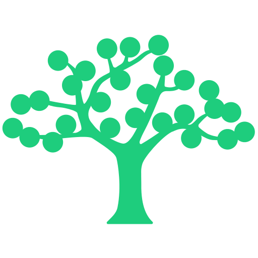

# Terraform Provider for ReadMe.com

[](https://github.com/liveoaklabs/terraform-provider-readme/releases)

Terraform provider for [ReadMe.com](https://readme.com)

It uses the [ReadMe API Go client](https://github.com/liveoaklabs/readme-api-go-client) and the
[Terraform Plugin Framework](https://developer.hashicorp.com/terraform/plugin/framework).



This provider is developed by [Live Oak Bank](https://liveoakbank.com) and is not affiliated with ReadMe.com.

## Usage

__Terraform 1.0+ is required.__

Refer to the [provider docs on the Terraform registry](https://registry.terraform.io/providers/LiveOakLabs/readme/latest/docs) for information
about using the provider.

## Getting Started

### Configure the Provider

```terraform
provider "readme" {
  # Set the API token here or with the README_API_TOKEN env var.
  # api_token = ""
}

terraform {
  required_providers {
    readme = {
      source  = "liveoaklabs/readme"
      version = "~> 0.1"
    }
  }
}
```

### Manage Resources

Create an API specification:

```terraform
resource "readme_api_specification" "example" {
  # 'definition' accepts a string of an OpenAPI specification definition JSON.
  definition = file("petstore.json")
}
```

Create a category:

```terraform
resource "readme_category" "example" {
    title = "My example category"
    type  = "guide"
}
```

Create a doc:

```terraform
resource "readme_doc" "example" {
    # title can be specified as an attribute or in the body front matter.
    title = "My Example Doc"

    # category_slug can be specified as an attribute or in the body front matter.
    category_slug = readme_category.example.slug

    # hidden can be specified as an attribute or in the body front matter.
    hidden = false

    # order can be specified as an attribute or in the body front matter.
    order = 99

    # type can be specified as an attribute or in the body front matter.
    type = "basic"

    # body can be read from a file using Terraform's `file()` function.
    body = file("mydoc.md")
}
```

Create a version:

```terraform
resource "readme_version" "example" {
  version   = "1.1.0"
  from      = "1.0.0"
  is_hidden = true
}
```

### Use Data Sources

The provider includes several data sources. Refer to the
[provider docs on the Terraform registry](https://registry.terraform.io/providers/LiveOakLabs/readme/latest/docs/data-sources/api_registry)
for a full list with examples.


## Versioning and Releases

This project uses semantic versioning and is currently in _development_ status using a `0.x.x` versioning scheme.

Breaking changes are likely to occur within the `0.x` _minor_ versions. Once the project reaches `1.0.0`, typical rules
for semantic versioning will apply.

Refer to the [CHANGELOG](CHANGELOG.md) for release details.

## Contributing

Refer to [`CONTRIBUTING.md`](CONTRIBUTING.md) for information on contributing to this project.

## License

This project is licensed under the MIT License - see the [`LICENSE`](LICENSE) file for details.
